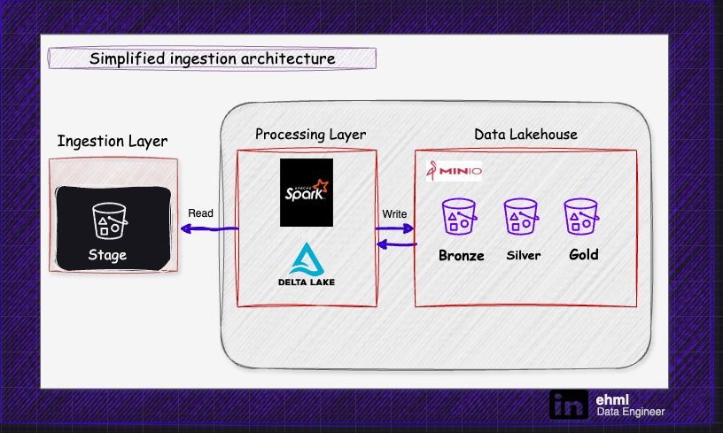

## PROJECT 1 - HOTEL BOOKING

### Description:
This project demonstrates how to use Apache Spark with Delta Lake to interact with Minio, an object storage service, for data storage and manipulation. The setup involves configuring Spark to work with Delta Lake and Minio, and then writing data from a CSV file to Minio in Delta format using Spark.

- [Data source](https://www.kaggle.com/datasets/mojtaba142/hotel-booking)

### Components:

- **Apache Spark with Delta**: Apache Spark is a powerful analytics engine for big data processing, while Delta Lake provides ACID transactions, scalable metadata handling, and unifies streaming and batch data processing. Together, they enable efficient data processing and management.

- **Minio**: Minio is an open-source object storage server compatible with Amazon S3 cloud storage service. It is used here as the data storage solution, allowing for scalable and distributed storage of files in buckets.

- **Jupyter Notebook**: Jupyter Notebook is an interactive computing environment that allows users to create and share documents containing live code, equations, visualizations, and narrative text. It provides an easy-to-use interface for running Python code snippets and visualizing data.

- **Docker Compose**: Docker Compose is a tool for defining and running multi-container Docker applications. It allows developers to define the services, networks, and volumes required for their application in a single YAML file and then spin up the entire application stack with a single command.

#### Configuration:
- Ensure that Minio is running and accessible at `http://localhost:9000`.
- Modify the Minio access key, secret key, and endpoint in the provided code to match your Minio setup.
- Adjust the Docker volumes and environment variables in the docker-compose file as needed.

#### Notes:
- This project assumes a local Minio setup for testing purposes. Adjust configurations accordingly for production environments.
- Ensure proper security measures are implemented, especially when dealing with access keys and secret keys.
- Delta Lake provides ACID transactions, scalable metadata handling, and unifies streaming and batch data processing.